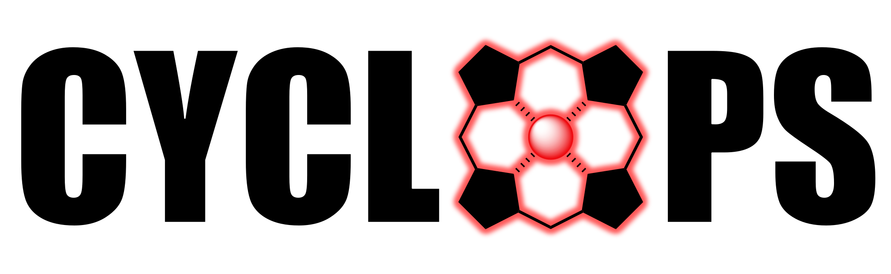

.. cyclops documentation master file.

===================================================================
CYtochrome Complex Ligand Optimization with Protein Simulation
===================================================================

CYCLOPS is a package for automating the simulation and analysis of Heme-Ligand complexes.

* For installation instructions and first simulation set, go to :doc:`/getting_started`.
* For more advanced guides, visit the :doc:`/user_guide`.

.. grid:: 1 1 2 2

    .. grid-item-card:: Getting Started
      :margin: 0 3 0 0
      
      Installation and your first simulation.

      .. button-link:: ./getting_started.html
          :color: primary
          :outline:
          :expand:

          Go to Getting Started

    .. grid-item-card::  User Guide
      :margin: 0 3 0 0
      
      Detailed tutorials and workflows.

      .. button-link:: ./user_guide.html
          :color: primary
          :outline:
          :expand:

          Go to User Guide
      
    .. grid-item-card:: API Reference
      :margin: 0 3 0 0
      
      Technical documentation for all functions.

      .. button-link:: ./api.html
          :color: primary
          :outline:
          :expand:

          Go to API Reference

    .. grid-item-card::  Developer Guide
      :margin: 0 3 0 0
      
      How to contribute to CYCLOPS.

      .. button-link:: ./developer_guide.html
          :color: primary
          :outline:
          :expand:

          Go to Developer Guide
              
----

Citing CYCLOPS
--------------

If you use CYCLOPS in your research, please cite:

.. card:: Grenda et al., 2025

   Grenda, P., Ogos, M., & Hruška, E. (2025). *Automated Structural Refinement of Docked
   Complexes in Cytochrome P450 Using Molecular Dynamics*. ChemRxiv.
   `https://doi.org/10.26434/chemrxiv-2025-mvv4k-v3 <https://doi.org/10.26434/chemrxiv-2025-mvv4k-v3>`_

.. code-block:: bibtex

   @article{doi:10.26434/chemrxiv-2025-mvv4k-v3,
     author  = {Grenda, Przemys{\l}aw and Ogos, Martyna and Hru{\v{s}}ka, Eugen},
     title   = {Automated Structural Refinement of Docked Complexes in Cytochrome P450
                Using Molecular Dynamics},
     journal = {ChemRxiv},
     year    = {2025},
     doi     = {10.26434/chemrxiv-2025-mvv4k-v3},
     url     = {https://chemrxiv.org/doi/abs/10.26434/chemrxiv-2025-mvv4k-v3}
   }

.. toctree::
   :maxdepth: 2
   :hidden:
   :titlesonly:

   getting_started
   user_guide
   api
   developer_guide

